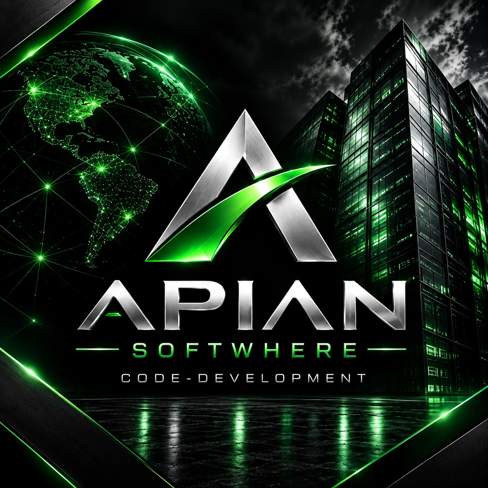

<p align="center">
  
</p>

<h1 align="center">Code-Development</h1>

<p align="center">
  <em>An Apian Software engineering atlas — route the artifact, verify the change, print every count.</em>
</p>

<p align="center">
  <strong>Contract v1.2.1</strong> · <a href="https://github.com/ApianSoftware/Code-Development/releases">releases</a> · harness package <code>code-development-harness</code><br>
  29 language routes · 25 hard invariants, all enforced · 24 mutation cases · 0 warnings
</p>

<p align="center">
  <a href="docs/VERSIONING.md">versioning &amp; releases</a> ·
  <a href="SECURITY.md">security</a> ·
  <a href="docs/ENGINEERING-CONCEPTS.md">concepts &amp; mechanisms</a> ·
  <a href="docs/INDEX.md">full index</a>
</p>

---

> ### Never a silent break
>
> **The expensive break is the one whose output is identical to success.** A guard that checked
> nothing, a test that ran zero cases, a backup that pushed nowhere, and a router that served an
> error as an answer all printed exactly what a working system prints.
>
> So the order here is fixed: **make the break unrepresentable → if it can still happen, make it
> impossible to be silent → only then detect it.** A detector added for a fault that could have
> been deleted is maintenance forever. Mechanisms, each with the sighting that produced it:
> [Anti-break, three tiers](docs/ENGINEERING-CONCEPTS.md).

Advanced, model-aware engineering atlas and operating system for programming languages, AI coding systems, agents, Git/GitHub, APIs, MCP/connectors/Skills/plugins, data/research, storage, backends, performance, security, reliability, routing, and verification.

**Every number on this page is printed by an instrument, not typed.** Re-run them with
`python scripts/atlas.py check` and `python scripts/packprobe.py`; where a number has a blind
spot, the blind spot is named beside it.

> **Read first:** [MODEL.md](MODEL.md) → [docs/INDEX.md](docs/INDEX.md) → [atlas.yaml](atlas.yaml) → runtime/model adapter → language guide → operating card → tool manifest → boundary → task route → scoped tools → verification.

## If you are an agent, start here

Do not read this repository breadth-first; it is a routing table, not a manual. **Ask it where to
go, then read only what it names.**

```bash
python scripts/atlas.py route path/to/file.ext   # language, toolchain, card, manifest, labels, lane, gates
python scripts/atlas.py plan path/to/file.ext --task debugging
python scripts/atlas.py check                    # does the repository still satisfy its own contract?
python scripts/atlas_test.py                     # does the contract still detect planted defects?
python scripts/packprobe.py                      # which declared toolchains actually resolve here
```

`route` is the entry point and answers in one call. `check` exits non-zero on a contract fault, so
gate on the **exit code**, never on a line of output. Everything else in this file is context for a
route you have already resolved.

**What this repository does not know about your machine:** the packs declare toolchains; nothing
declares that they are installed. `packprobe` is how you find out before you plan around one.

## Start here — by what you are trying to do

A flat list makes you read all of it to find one thing. Find your row, follow one link.

| I want to… | Go here |
|---|---|
| **route one file** and get its toolchain | `atlas.py route` · [Code-specific routing](wiki/CODE-ROUTING.md) |
| **pick a language**, or add one | [Languages](languages/ATLAS.md) · [Language packs](languages/README.md) · [Pack contract](languages/PACK-SPEC.md) |
| **know what a pack must contain** | [Language tool manifest contract](tools/README.md) |
| **run a language in production** | [Language operations](wiki/LANGUAGE-OPERATIONS.md) · [Systems](systems/README.md) |
| **choose or orchestrate tools** | [Tool orchestration](wiki/TOOL-ORCHESTRATION.md) · [MCP language matrix](integrations/MCP-LANGUAGE-MATRIX.md) |
| **choose a model or runtime** | [Models and runtimes](models/README.md) |
| **branch, merge, or clean up a worktree** | [Branch/worktree model](wiki/BRANCH-WORKTREES.md) · [Labels and tags](wiki/LABELS-TAGS.md) |
| **configure GitHub**, or see what is actually enforced | [GitHub backend](docs/GITHUB-BACKEND.md) · [GitHub finalization](docs/GITHUB-FINALIZATION.md) |
| **understand WHY a rule here exists** | [Engineering concepts, each paired with a mechanism](docs/ENGINEERING-CONCEPTS.md) |
| **report or handle a vulnerability** | [Security policy](SECURITY.md) |
| **read the background research** | [Research](research/PROGRAMMING-RESEARCH-2026.md) |
| **browse everything** | [Code-development wiki](wiki/README.md) · [docs/INDEX.md](docs/INDEX.md) |

## Goal-first code routing

Use the artifact route before choosing a model or tool:

```bash
python scripts/atlas.py route path/to/file.py
python scripts/atlas.py plan path/to/file.py --task debugging
```

The route resolves language, native authority, runtime, MCP profile, operating card, tool manifest, labels, branch lane, worktree, and verification. The plan command adds task-specific assurance.

```bash
python scripts/atlas.py learn rust
```

`learn` turns a language's operating card and tool manifest into the seven-pass mastery loop, so an agent or developer deepens exactly one language at a time.

## Branches and worktrees

One checkout is the main worktree and is never a branch lane. Lanes merge into the
default branch only, by rebase then fast-forward; a lane with `ahead=0` against
`main` is finished, and the worktree is removed in the session that merges it. The
full rules, including the roster sweep that prints what is still on disk, are in
[wiki/BRANCH-WORKTREES.md](wiki/BRANCH-WORKTREES.md).

## Hard invariants are owned, not listed

`atlas.yaml` declares 25 hard invariants. Each one maps in `scripts/atlas.py` to
either a CHECK that fails the contract or a DECLARATION naming why this repository
cannot check it and what would. An invariant in neither list fails the contract, so
the roster cannot quietly grow promises nobody owns:

```bash
python scripts/atlas.py invariants
```

A declared blind spot is a promise to come back, not an exemption. The contract
prints the split on every run (`invariants N enforced + M declared/25`).

## The harness is tested

`scripts/atlas_test.py` plants a real defect on disk for each rule the contract
claims to enforce — a hand-edited generated block, a version skew, a manifest with
a missing or mismatched key, a route whose label is not in the catalog, a route
with no pack — and asserts the check fails on each, that a clean tree passes, that
`index --write` repairs the drift it reports and is idempotent, and that ten route
edge cases behave (no extension, uppercase, a path outside the repository, a nested
pack). It asserts its own case count, because a harness that silently skips cases
prints a full pass. CI runs it before the contract.

## Instruments — what each one proves, and what it does not

**A number with no instrument beside it is rhetoric, and an instrument with no declared blind spot
is read as proving more than it does.** Every executable in `scripts/` is listed here with both.

| instrument | proves | blind spot |
|---|---|---|
| `atlas.py check` | the repository satisfies its own contract — links, routes, guides, cards, manifests, labels, generated blocks, invariants | STRUCTURE only. It cannot tell whether a declared tool exists or a manifest is true. |
| `atlas.py route` / `plan` | the resolved language, authority, card, manifest, labels, lane and verification gates for one artifact | routing, not correctness of the thing routed to |
| `atlas.py invariants` | every one of the 25 hard invariants is either CHECKED or DECLARED, and names which | a declared blind spot is a promise to come back, not an exemption |
| `atlas_test.py` | the contract still FAILS on a planted defect — 24 mutation cases, and it asserts its own case count | it tests the CONTRACT, not the truth of a manifest's tool names |
| `check_contract.py` | the contract runs from the repository root, from `scripts/`, and from an unrelated directory | path independence only |
| `packprobe.py` | how many declared tool names resolve on THIS machine, per pack, with coverage printed | `command -v` finds a NAME. It does not run the tool, check a version, or prove a pack was exercised. Absent here is not wrong. |
| `ruff check` | lint over the six Python files, configured in [pyproject.toml](pyproject.toml) | `ruff format` is deliberately NOT enforced; the reason is in that file |

Measured 2026-09-24: `packprobe` reports **25 of 133 binary-shaped declared tools resolve here
(18%)**, and excludes **127 prose entries** from the denominator. Most zero-coverage packs are
correct — nobody installs every toolchain on one machine. The finding worth acting on is that 49%
of declared entries are prose sitting in fields that also hold binaries, which is why no mechanical
verification of the packs existed before.

## Dynamic verification

The repository selects the smallest sufficient verification surface from the task and risk. Required gates are explicit:

<!-- BEGIN generated: verification-gates (python scripts/atlas.py index --write) -->
```text
source_change      -> formatter + compiler_or_typechecker + unit_tests
api_change         -> schema_validation + contract_tests + endpoint_tests + compatibility_check
dependency_change  -> dependency_graph + dependency_review + vulnerability_scan + tests
security_sensitive -> codeql + secret_scan + static_analysis + tests
concurrency_change -> race_detection + cancellation_tests + timeout_tests + stress_test
performance_change -> benchmark + profiler + representative_workload + regression_threshold
```
<!-- END generated: verification-gates -->

Use four severity classes: `blocker/error` are merge-blocking; `warning` is visible and actionable but normally non-blocking; `info` is report-only; `baseline` is limited to already-known findings. New findings must never be hidden by baseline growth.

## Assurance chain

```text
GOAL
 -> route
 -> native compiler/LSP/debugger/tester
 -> language tool manifest
 -> semantic repository context
 -> boundary contract
 -> targeted docs/browser/database capability
 -> security/dependency analysis
 -> independent verification
 -> CI
```

Do not load every tool, MCP, or language guide. Activate only the capability needed by the goal/failure class.

## Codespaces

A codespace boots from [.devcontainer](.devcontainer/README.md): Python plus the
harness dependency, with the contract run on create. Its purpose is confirming a
language pack against the real toolchain — add that one language as a devcontainer
feature, run `atlas.py learn <language>`, confirm the names in that pack's
`provenance.verify`, then remove the feature. Editing documents is faster locally.

## Multi-language design

Use multiple languages only when a language contributes a distinct guarantee, runtime property, ecosystem, or performance characteristic. Define the boundary first, then assign ownership.

```text
Python -> Rust/C++/Mojo native core
TypeScript -> Go/Rust service
Python/Julia -> native/accelerator component
local process -> bounded stdio/schema
service -> versioned RPC/message schema
portable component -> WebAssembly/WASI
```

See [systems/POLYGLOT-ENGINEERING.md](systems/POLYGLOT-ENGINEERING.md).

## Learning / mastery loop

`read reference → trace real code → reproduce tiny example → modify → break intentionally → verify → benchmark → record lesson`.

Prefer primary documentation and repository examples over copied summaries. Each language pack includes a fast path, an operating card, and research links so an AI or developer can deepen only the language currently in use. Every route carries a machine-readable `tools.yaml`; entries listed under `provenance.verify` are to be confirmed against the language's documentation before a task relies on them, and `none` means no established tool is known for that role.

Release notes: [docs/VERSIONING.md](docs/VERSIONING.md) (one line per version, the only changelog).
