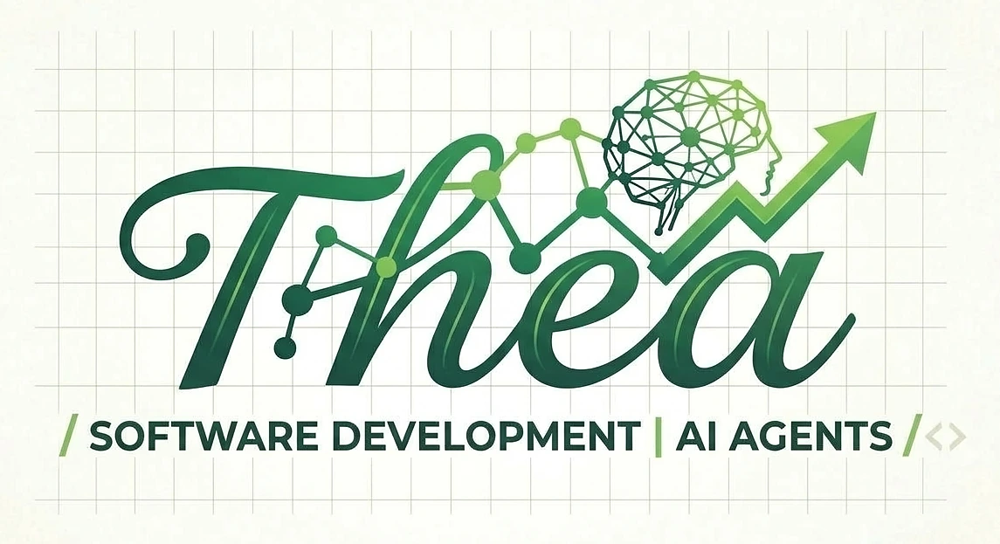

<!-- AGENTS: do not read this page breadth-first. Start at .agent/bootstrap.json or llms.txt,
     then ask `python scripts/atlas.py gate <file>` — one command back. -->
<p align="center">
  
</p>

<h1 align="center"><picture>
  <source media="(prefers-color-scheme: dark)" srcset="docs/assets/title-dark.svg">
  
</picture></h1>

<p align="center">
  <strong>Thea Software, by Heartland Intel.</strong><br>
  A machine-readable rulebook for AI coding agents, and the build checks that enforce it.<br>
  <em>AI proposes a change. The file's own toolchain proves it. The build refuses what skipped a check.</em>
</p>

<p align="center">
  <a href="https://github.com/HeartlandIntel/thea-software/actions/workflows/atlas-ci.yml"></a>
  <a href="https://scorecard.dev/viewer/?uri=github.com/HeartlandIntel/thea-software"></a>
  <a href="https://github.com/HeartlandIntel/thea-software/actions/workflows/scorecard.yml"></a>
  <a href="LICENSE"></a>
  <a href="https://github.com/HeartlandIntel/thea-software/releases/latest"></a>
</p>

<p align="center">
  <a href="#quickstart">quickstart</a> ·
  <a href="#what-it-measurably-buys">results</a> ·
  <a href="#find-your-way">docs</a> ·
  <a href="SECURITY.md">security</a> ·
  <a href="docs/CERTIFICATION.md">what each badge proves</a> ·
  <a href="docs/VERSIONING.md">changelog</a> ·
  <a href="LICENSE">MIT</a>
  <br><sub>An AI reading this: agents start at <a href="llms.txt">llms.txt</a>, chats at <a href="CHAT.md">CHAT.md</a>.</sub>
</p>

---

## What it does

Point it at a file. It prints the commands that prove a change there, taken from that language's
own toolchain, and refuses work that skipped them.

<!-- BEGIN generated: gate-example (python scripts/atlas.py index --write) -->
```console
$ thea gate scripts/doctor.py
1. formatter: ruff format --check scripts/doctor.py
2. compiler_or_typechecker: python3 -c 'import ast,sys; [ast.parse(open(f, encoding="utf-8").read(), f) for f in sys.argv[1:]]' scripts/doctor.py
3. unit_tests: pytest
```
<!-- END generated: gate-example -->

- **One answer, not a manual.** An agent asks `thea gate <file>` instead of reading the repository.
- **Checked by the build, not by memory.** Every rule lives in [`atlas.yaml`](atlas.yaml) and a program
  checks it, so a document, count or version that drifts from the code fails the build.
- **Your agent keeps its own tools.** Thea adds a CLI, a git hook and a read-only MCP server to
  [each supported runtime](#what-each-runtime-reads-before-it-starts) and never removes a tool it ships with.
- **Honest verdicts.** `thea verify` reports each gate as PASS, FAIL or NOT RUN from its exit code; a
  gate that did not run is never counted as a pass.
- **Mistakes stay fixed.** A break is filed with the [`thea` skill](skills/thea/SKILL.md) and becomes a
  test that fails if it returns.

**Not** an app framework, a runtime optimizer or a sandbox: it measures performance and bounds agents,
and host isolation is still the host's job.

## Quickstart

```bash
python scripts/atlas.py gate   scripts/doctor.py    # the commands that prove a change to this file
python scripts/atlas.py route  scripts/doctor.py    # its language pack, card, manifest and lane
python scripts/atlas.py plan   scripts/doctor.py --task implementation --change source_change
python scripts/verify.py                            # every gate, one verdict each; exit 0 only if all PASS
python scripts/atlas.py doctor                      # can this machine run the instruments?
```

Installed, the same commands answer as **`thea <command>`** (`thea commands` lists them) and
**`thea-mcp`** serves them as read-only MCP tools. Add `--json` for a record frozen in
[tools/atlas-output.schema.json](tools/atlas-output.schema.json): depend on route ids, gate ids and
manifest paths, never on rendered Markdown. Use it from another repository without vendoring it:
[docs/CONSUMING.md](docs/CONSUMING.md).

## What it measurably buys

Every figure comes from a recorded run and names the instrument and contract version that produced it.

<!-- BEGIN generated: measured-benefits (python scripts/atlas.py index --write) -->
*With Thea*: the model is shown what `thea gate` prints for the file. *Blind*: it gets only the list
of language names. Token savings are against the usual alternative: pasting in every language's tool list.

**On Claude** (39 questions per model, `abtest.py` v2.28.0)
- **Opus:** 100% right with Thea, 41% blind; reads 91% fewer tokens.
- **Sonnet:** 95% right with Thea, 41% blind; reads 91% fewer tokens.
- **Haiku:** 97% right with Thea, 41% blind; reads 91% fewer tokens.
- **Claude Code start-up:** reads only `CLAUDE.md`, 67 tokens.

**Beyond routing** (blind → with Thea, `taskbench.py` v2.29.0)
- **Name a failure from its symptom:** Opus 93% → 100%; Sonnet 57% → 100%; Haiku 64% → 96%.
- **List the checks a change needs:** Opus 12% → 100%; Sonnet 12% → 100%; Haiku 0% → 100%.
- **Spot a line the build refuses (yes/no, so a coin flip scores 50%):** Opus 60% → 100%; Sonnet 60% → 100%; Haiku 40% → 100%.
- *Not measured:* visual design, open-ended strategy, arithmetic — nothing declares a right answer.

**Across all 11 models tested** (5 providers, 2,076 questions, `abtest.py` v2.27.0 / v2.28.0)
- **Right answers:** 98% with Thea, 63% blind; every model 95–100% with Thea. A random guess scores 2.8%.
- **Tokens:** reads 89% fewer than pasting every tool list, and 51% fewer than asking blind.

**The repository itself** (recomputed on every build)
- **Before routing:** an agent reads 1,747 tokens. The other 156 documents (465 KiB) load only when a route names one.
- **Coverage:** all 324 language × check pairs answer — 133 with a command, 191 with a declared *no tool*, 0 silently.
- **Mistakes caught:** 185 kinds are planted in the tests, and each must be refused.
- **Enforced at commit:** refused 17 of 17 planted breaks in 12 languages; 11 files untested here (`enforce.py`, v3.6.0).
- **Agent-to-agent handoffs with the right checks** (schema alone → with Thea): Opus 0/6 → 6/6; Sonnet 0/6 → 6/6; Haiku 0/6 → 6/6 (`workflowbench.py`).
- **Solo commits:** 24/24 clean with or without the hook on these tasks; a planted broken commit is refused.
- **Agent controls that block, not warn:** narrow_tools, sandbox, budget, approval, audit.
- **Install:** 5 KiB, 1 modules, 1 dependency — 1 in total with its own dependencies.
<!-- END generated: measured-benefits -->

### What each runtime reads before it starts

<!-- BEGIN generated: runtime-entry (python scripts/atlas.py index --write) -->
| runtime | loads by itself | ~tokens |
|---|---|---|
| **Claude Code** | `CLAUDE.md` | 1,105 |
| Codex | `AGENTS.md` | 1,038 |
| Cursor | `AGENTS.md` | 1,038 |
| opencode | `AGENTS.md` | 1,038 |
| Zed | `AGENTS.md` | 1,038 |
| Hermes | `.agent/bootstrap.json` | 641 |
| any model given a link | `llms.txt` | 1,091 |
| any chat assistant | `CHAT.md` | 2,132 |

Measured from each file on every build.
<!-- END generated: runtime-entry -->

## How it works

| part | what it gives you | where |
|---|---|---|
| **Routing** | the language pack for any file, and *which precedence rule* chose it | `atlas route` · [routing](wiki/CODE-ROUTING.md) |
| **Gates** | the change class picks the checks; each resolves to a command the pack declares, or to a declared *no tool* | `atlas gate` · [verification](docs/VERIFY.md) |
| **Language packs** | compiler, formatter, tests, debugger, profiler, security tool per language, loaded only when routed | [languages](languages/ATLAS.md) · [pack contract](languages/PACK-SPEC.md) |
| **Runtime adapters** | how Thea loads in each agent, and the mistake that agent makes | [models](models/README.md) |
| **Agent harness** | a task contract whose controls refuse rather than warn, and a hash-chained audit | [agent harness](systems/AGENT-HARNESS.md) |
| **Enforcement** | a pre-commit hook for any agent, CI on every pull request, a landing that cannot strand a branch | `enforce.py` · `branchstate.py --land` |

**The rules it will not bend:** route before reading · a gate resolves to a real command or says it
has none · ambiguity is refused, never guessed · every write is read back · the exit code is the
verdict. Each names the defect it was measured against in `atlas.yaml/parser_discipline` and
`agent_failure_modes`; `thea why` explains any of them.

### Required gates by change class

<!-- BEGIN generated: verification-gates (python scripts/atlas.py index --write) -->
```text
source_change      -> formatter + compiler_or_typechecker + unit_tests
api_change         -> schema_validation + contract_tests + endpoint_tests + compatibility_check
dependency_change  -> dependency_graph + dependency_review + vulnerability_scan + tests
security_sensitive -> codeql + secret_scan + static_analysis + tests
concurrency_change -> race_detection + cancellation_tests + timeout_tests + stress_test
performance_change -> benchmark + profiler + representative_workload + regression_threshold
retrieval_change   -> chunk_boundary_test + freshness_stamp + hybrid_recall_check + citation_check
quantum_change     -> simulator_run + shot_count_declared + noise_model_declared + resource_estimate + classical_baseline_comparison
```
<!-- END generated: verification-gates -->

`blocker` and `error` block the merge; `warning` is visible and normally non-blocking; `info` is
report-only; a baseline holds known findings only and may never absorb a new one.

## For agents

Parse [.agent/bootstrap.json](.agent/bootstrap.json), ask `thea gate <file>`, load only what the
answer names. Reading this tree breadth-first is the failure named in
`atlas.yaml/context_policy/forbidden_default`.

- **Land** with `python scripts/branchstate.py --land`. A bare push of a lane is refused, because a
  pushed branch nothing will merge looks finished and is not.
- **Audit read-only** with `THEA_READ_ONLY=1`: the planted suite refuses to run beside a live editor.
- **Enable an MCP server per task**, never by default: its tool list is paid on every request.
- **When something goes wrong**, file it the same turn with the [`thea` skill](skills/thea/SKILL.md).

## Why it exists

**The expensive break is the one whose output looks like success:** a guard that checked nothing, a
test that ran zero cases, a gate command that passed on zero files. Thea's order is fixed: make the
break impossible to represent; if it can still happen, make it loud; only then detect it. Two were
found here by causing them — a duplicate YAML key that silently moved every F# file to another pack,
and a harness file that stopped compiling while the contract still printed its counts. Both are now
refused by the build. More: [Engineering concepts](docs/ENGINEERING-CONCEPTS.md).

## Counts, computed

Every number here is generated from the tree on each build, and `check` fails when one drifts.

<!-- BEGIN generated: repository-facts (python scripts/atlas.py index --write) -->
- **contract version:** 3.10.0 — `VERSION`, asserted at a declared line in 6 other files
- **artifact extensions routed:** 53 — `atlas.yaml/artifact_routes`
- **language routes:** 36 — distinct targets of those extensions
- **tool manifests:** 36 — `languages/<route>/tools.yaml`, validated against `tools/tools.schema.json`
- **declared tool entries:** 372 — distinct entries per manifest, summed; `packprobe.py` classifies every one
- **entry kinds:** 5 — `tools/tools.schema.json` `$defs.entry.x-kinds`
- **hard invariants:** 34 — each CHECKED or DECLARED, never neither
- **instruments:** 41 — `atlas.yaml/instruments`, each naming its own limits
- **verification gate classes:** 8 — `atlas.yaml/verification_policy/profiles`
- **task profiles:** 14 — `atlas.yaml/task_profiles`
- **python files in the harness:** 41 — `scripts/*.py`, all linted by ruff
<!-- END generated: repository-facts -->

Each instrument declares what it proves, what it does not, and who closes the gap
([docs/CERTIFICATION.md](docs/CERTIFICATION.md)). Each hard invariant is checked or its blind spot
declared (`thea invariants`). The planted suite plants a real defect for every rule, asserts the
build refuses it, restores the file, and asserts its own case count.

## Find your way

| to… | go to |
|---|---|
| route a file or run a pack's tool | `atlas route` · `atlas do` · [manifest contract](languages/PACK-TOOLS-SPEC.md) · [tools.schema.json](tools/tools.schema.json) |
| follow a named process end to end | `atlas process` · [verification](docs/VERIFY.md) |
| pick or add a language | [languages](languages/ATLAS.md) · [packs](languages/README.md) · `atlas pick` · `atlas learn` |
| combine languages | [polyglot engineering](systems/POLYGLOT-ENGINEERING.md) |
| run an agent under real controls | [agent-task.schema.json](tools/agent-task.schema.json) · [agent harness](systems/AGENT-HARNESS.md) |
| run a language in production | [language operations](wiki/LANGUAGE-OPERATIONS.md) · [systems](systems/README.md) |
| choose tools, a model or a runtime | [tool orchestration](wiki/TOOL-ORCHESTRATION.md) · [MCP matrix](integrations/MCP-LANGUAGE-MATRIX.md) · [models](models/README.md) |
| land work or clean a worktree | [branch and worktree model](wiki/BRANCH-WORKTREES.md) |
| configure or audit GitHub | [GitHub backend](docs/GITHUB-BACKEND.md) · [finalization](docs/GITHUB-FINALIZATION.md) · `ghaudit.py` |
| add a dependency well | [package catalog](docs/PACKAGE-CATALOG.md) · [dependencies](docs/DEPENDENCIES.md) |
| try one toolchain in a codespace | [.devcontainer](.devcontainer/README.md) |
| report a vulnerability | [security policy](SECURITY.md) |
| read everything else | [docs index](docs/INDEX.md) · [wiki](wiki/README.md) · [research](research/ENGINEERING-RESEARCH.md) |

## Project

The version tracks the **contract**, not the content: changing what is enforced, what a route
resolves to or what a gate requires is a version; a new guide paragraph is not. One line per version
is the changelog, and every release is tagged: [docs/VERSIONING.md](docs/VERSIONING.md).

Built by **Heartland Intel** and public on purpose (formerly *Code-Development*): an atlas that needs
a token to read cannot route an agent that has none. The price is one absolute rule: **no secret,
credential, private-project path or internal hostname enters this repository**, in any file or in
history. [ABOUT.md](ABOUT.md) covers what lives here and what stays private.

Contributions follow the same contract as any change: `thea verify` must pass, and the pull request
template asks what would prove the goal met. Licensed under the [MIT License](LICENSE).
