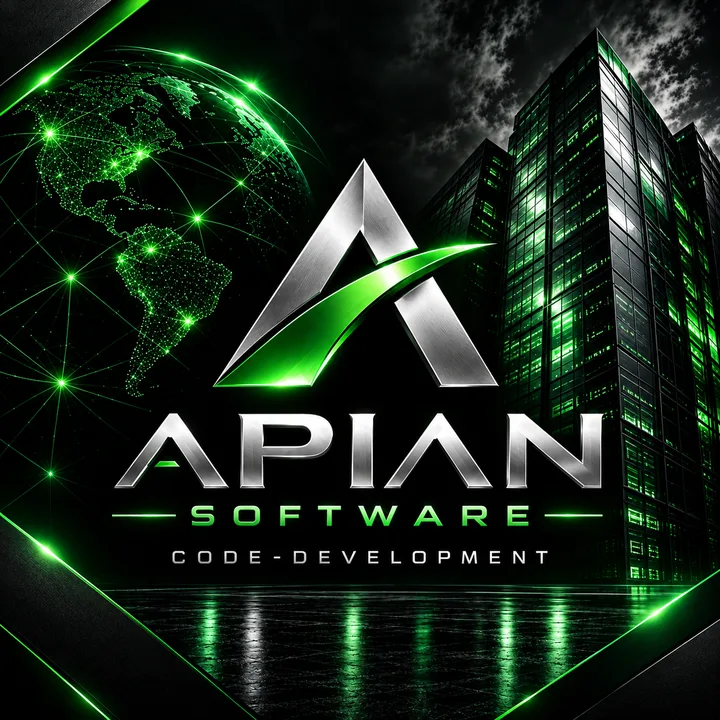

<p align="center">
  
</p>

<h1 align="center">The Engineering Atlas</h1>

<p align="center">
  <em>Route the artifact. Verify the change. Print every count.</em>
</p>

<p align="center">
  <a href="https://github.com/ApianSoftware/Code-Development/actions/workflows/atlas-ci.yml"></a>
  <a href="https://scorecard.dev/viewer/?uri=github.com/ApianSoftware/Code-Development"></a>
  <a href="https://github.com/ApianSoftware/Code-Development/actions/workflows/scorecard.yml"></a>
  <a href="LICENSE"></a>
  <a href="https://github.com/ApianSoftware/Code-Development/releases/latest"></a>
</p>

<p align="center">
  <sub>Every badge is served by whoever measures it — none is typed here.
  <a href="docs/CERTIFICATION.md">What each one proves</a>.</sub>
</p>

<p align="center">
  <a href="docs/VERSIONING.md">contract v2.19.0</a> ·
  <a href="docs/INDEX.md">index</a> ·
  <a href="docs/CONSUMING.md">use it elsewhere</a> ·
  <a href="llms.txt">llms.txt</a> ·
  <a href="SECURITY.md">security</a> ·
  <a href="docs/CERTIFICATION.md">certification</a> ·
  <a href="https://github.com/ApianSoftware/Code-Development/releases">releases</a> ·
  <a href="LICENSE">MIT</a>
</p>

---

## What this is

**The Engineering Atlas is the shared engineering substrate for [Apian Software](https://github.com/ApianSoftware):
one repository that decides how every other repository is built, verified and changed — and
answers by command rather than by document.**

Engineering knowledge rots the same way everywhere: a standard is written down, the code moves,
and the document keeps saying what used to be true — confidently, in prose, where nothing can
check it. This repository is built the other way round. **Every rule is a declaration something
executes, and the build fails when an answer it gives has drifted from the tree.**

It is three parts that cannot disagree with each other:

| | |
|---|---|
| **One declaration** | `atlas.yaml` — every route, gate, process, budget, control and policy, in one file |
| **One harness** | Python that *enforces* it — instruments and hard invariants, each naming what it does **not** prove (counts in the facts block below) |
| **35 language packs** | each declaring its own compiler, formatter, test runner, debugger, profiler and security tool — none loaded until a route names it |

You do not read it. You ask it — `route`, `plan`, `process`, `do`, `pick`, `why` — and it answers
as prose for a person or as a schema-frozen JSON record for a machine.

### Who it is for

- **Engineers on a polyglot codebase**, who need one answer to "which toolchain owns this file,
  and what must pass before it merges" instead of thirty-five conventions held in someone's head.
- **AI coding agents**, handed a router and a bounded entry path rather than a repository
  (`scripts/contextcost.py` prints what that costs), running under task-contract controls — path,
  command, budget, approval, audit — that *refuse* rather than warn.
- **CI and consuming repositories**, which pin a version, call a reusable workflow, and depend on
  route ids and gate ids that are frozen in a schema — never on rendered Markdown.

### What makes it different

- **One question, one call.** `atlas route <file>` returns the pack, the operating card, the tool
  manifest, the issue label, the branch lane and the required gates — and names *which precedence
  rule resolved it, with the evidence*, so an explicit match and a lucky guess never look alike.
- **The packs are wiring, not a catalogue.** `atlas do <file> test` runs whatever *that* language
  declares as its test runner. One implementation covers all 35; change a pack and its gate and
  its command both follow, because there is no second roster to update.
- **Nothing is claimed that was not measured.** No count is typed into prose. No claim carries a
  date — it carries the contract version it was measured at. The entry cost, the install
  footprint, the function shape and the example coverage are **ratchets that only fall**.
- **Every limit names its closer.** An instrument that cannot prove something says so, and names
  what does. A blind spot with no owner fails the build.
- **It stays out of your way.** ~160 KiB installed, one runtime dependency, no toolchain installed
  by default, and the policy is pointed at rather than vendored.

Released under MIT. Contract version and changelog: [docs/VERSIONING.md](docs/VERSIONING.md).

## Quickstart

```bash
python scripts/atlas.py route scripts/doctor.py           # which pack, card, manifest, lane, label
python scripts/atlas.py plan  scripts/doctor.py --task implementation --change source_change
python scripts/atlas.py process implementation            # a named process, end to end
python scripts/atlas.py do    scripts/doctor.py           # every action this file's pack can run
python scripts/atlas.py check                             # the exit code IS the verdict
python scripts/atlas.py doctor                            # can THIS machine run the instruments?
```

Add `--json` for a record instead of prose. Those records are frozen in
[tools/atlas-output.schema.json](tools/atlas-output.schema.json) and are the external API:
**depend on route ids, gate ids and manifest paths — never on rendered Markdown.** Using the atlas
elsewhere without vendoring it: [docs/CONSUMING.md](docs/CONSUMING.md).

## Start here — by what you are trying to do

| I want to… | Go here |
|---|---|
| **route one file** and get its toolchain | `atlas.py route` · [Code-specific routing](wiki/CODE-ROUTING.md) |
| **run a pack's own tool** on a file | `atlas.py do` · [Manifest contract](languages/PACK-TOOLS-SPEC.md) |
| **follow a named process** end to end | `atlas.py process` · [Verification](docs/VERIFY.md) |
| **pick a language**, or add one | [Languages](languages/ATLAS.md) · [Language packs](languages/README.md) · [Pack contract](languages/PACK-SPEC.md) |
| **know what a pack must contain** | [tools.schema.json](tools/tools.schema.json) · [Pack tools spec](languages/PACK-TOOLS-SPEC.md) |
| **run an agent under real controls** | [agent-task.schema.json](tools/agent-task.schema.json) · [Agent harness](systems/AGENT-HARNESS.md) |
| **run a language in production** | [Language operations](wiki/LANGUAGE-OPERATIONS.md) · [Systems](systems/README.md) |
| **choose or orchestrate tools** | [Tool orchestration](wiki/TOOL-ORCHESTRATION.md) · [MCP language matrix](integrations/MCP-LANGUAGE-MATRIX.md) |
| **choose a model or runtime** | [Models and runtimes](models/README.md) |
| **branch, merge, or clean up a worktree** | [Branch/worktree model](wiki/BRANCH-WORKTREES.md) · [Labels and tags](wiki/LABELS-TAGS.md) |
| **configure GitHub**, or see what is enforced | [GitHub backend](docs/GITHUB-BACKEND.md) · [Finalization](docs/GITHUB-FINALIZATION.md) · `ghaudit.py` |
| **understand WHY a rule here exists** | `atlas.py why` · [Engineering concepts](docs/ENGINEERING-CONCEPTS.md) |
| **report or handle a vulnerability** | [Security policy](SECURITY.md) |
| **read the background research** | [Research](research/ENGINEERING-RESEARCH.md) |
| **browse everything** | [Wiki](wiki/README.md) · [docs/INDEX.md](docs/INDEX.md) |

## If you are an agent

Do not read this repository breadth-first — that failure is named in
`atlas.yaml/context_policy/forbidden_default`. Parse
[.agent/bootstrap.json](.agent/bootstrap.json), then route, then load only what the route names.
A runtime is handed **~1,700 tokens** before it asks anything; everything else is behind a route,
and `scripts/contextcost.py` is the ratchet that keeps it that way.

**Three instruction conventions, one generated body:** [CLAUDE.md](CLAUDE.md),
[AGENTS.md](AGENTS.md) and [llms.txt](llms.txt). None can name a document that does not exist, and
`check` fails on drift. Packs declare toolchains; nothing here declares them *installed* —
`packprobe.py --mode smoke` is how you find out before planning around one.

## The failure it exists to prevent

**The expensive break is the one whose output is identical to success.** A guard that checked
nothing, a test that ran zero cases and a router that served an error as an answer all print
exactly what a working system prints. So the order is fixed: **make the break unrepresentable → if
it can still happen, make it impossible to be silent → only then detect it.**

Two were found here by causing them, and neither was preventable by care:

- **A COLLISION that resolves silently.** A second `'.fs'` key in the route table moved every F#
  file to the Forth pack: YAML keeps the *last* duplicate key, reports nothing, and the diff reads
  as an addition. The fix is not a rule about being careful — **every YAML read here goes through a
  loader that REFUSES a duplicate key.**
- **A CORRUPTION that passes every document check.** A mechanical re-indent wrote a harness file
  that no longer compiled — twice — and the contract printed all of its counts anyway, because it
  validated documents and never asked whether its own code was valid Python. **Every tracked source
  file must now parse, and that check runs first.**

One sentence: **a tool that picks a winner where the input is ambiguous, or reports success where
it never looked, is worse than one that refuses.** Every mechanism with the sighting that produced
it: [Engineering concepts](docs/ENGINEERING-CONCEPTS.md) · `atlas.py why`.

## Nothing here states a count it did not compute

A number typed into prose is stale the moment the tree moves, and the reader cannot see that it
moved. Every count below is generated from `atlas.yaml` and the tree, and `check` fails when a
block differs from what the tree would produce. Machine-specific numbers are not written down at
all — the instrument that answers them is named instead.

<!-- BEGIN generated: repository-facts (python scripts/atlas.py index --write) -->
| fact | value | derived from |
|---|---|---|
| contract version | **2.19.0** | `VERSION`, asserted identical in 6 other files |
| artifact extensions routed | **53** | `atlas.yaml/artifact_routes` |
| language routes | **35** | distinct targets of those extensions |
| tool manifests | **35** | `languages/<route>/tools.yaml`, validated against `tools/tools.schema.json` |
| declared tool entries | **362** | distinct entries per manifest, summed; `packprobe.py` classifies every one |
| entry kinds | **5** | `tools/tools.schema.json` `$defs.entry.x-kinds` |
| hard invariants | **29** | each CHECKED or DECLARED, never neither |
| instruments | **24** | `atlas.yaml/instruments`, each naming its own limits |
| verification gate classes | **8** | `atlas.yaml/verification_policy/profiles` |
| task profiles | **14** | `atlas.yaml/task_profiles` |
| python files in the harness | **24** | `scripts/*.py`, all linted by ruff |
<!-- END generated: repository-facts -->

## Instruments — what each one proves, and who closes what it does not

Every claim here is settled by a command, not by a badge. Each instrument declares `proves`,
`does_not_prove` and **`closed_by`** — what covers the limit it cannot — and `check` refuses one
that leaves the closer empty, so a blind spot with no owner is unrepresentable rather than
discouraged. The roster is generated from `atlas.yaml/instruments` into
[docs/CERTIFICATION.md](docs/CERTIFICATION.md); the count is in the facts block above.

## Hard invariants are owned, not listed

`atlas.yaml` declares the hard invariants. Each maps in `scripts/atlas.py` to either a CHECK that
fails the contract or a DECLARATION naming why this repository cannot check it and what would. An
invariant in neither list fails the contract, so the roster cannot quietly grow promises nobody
owns:

```bash
python scripts/atlas.py invariants
```

A declared blind spot is a promise to come back, not an exemption. The command prints the split
between enforced and declared on every run, so the size of that table is read from the run and
never from this page.

## The harness is tested

`scripts/atlas_test.py` plants a real defect on disk for each rule the contract claims to enforce
— a hand-edited generated block, a version skew, a manifest with a missing key or an entry that is
prose, a route whose label is not in the catalog, an instrument with no closer — and asserts the
check fails on each; that a clean tree passes; that `index --write` repairs the drift it reports
and is idempotent; and that the route edge cases behave. It asserts its own case count, because a
harness that silently skips cases prints a full pass. Where `jsonschema` is installed it also
cross-checks this repository's own validator against that library. CI runs it before the contract.

## Dynamic verification

The repository selects the smallest sufficient verification surface from the task and the risk.
Required gates are explicit:

<!-- BEGIN generated: verification-gates (python scripts/atlas.py index --write) -->
```text
source_change      -> formatter + compiler_or_typechecker + unit_tests
api_change         -> schema_validation + contract_tests + endpoint_tests + compatibility_check
dependency_change  -> dependency_graph + dependency_review + vulnerability_scan + tests
security_sensitive -> codeql + secret_scan + static_analysis + tests
concurrency_change -> race_detection + cancellation_tests + timeout_tests + stress_test
performance_change -> benchmark + profiler + representative_workload + regression_threshold
retrieval_change   -> chunk_boundary_test + freshness_stamp + hybrid_recall_check + citation_check
quantum_change     -> simulator_run + shot_count_declared + noise_model_declared + resource_estimate + classical_baseline_comparison
```
<!-- END generated: verification-gates -->

Four severity classes: `blocker`/`error` are merge-blocking; `warning` is visible and actionable
but normally non-blocking; `info` is report-only; `baseline` is limited to already-known findings.
New findings must never be hidden by baseline growth.

## Assurance chain

```text
GOAL
 -> route
 -> native compiler/LSP/debugger/tester
 -> language tool manifest
 -> semantic repository context
 -> boundary contract
 -> targeted docs/browser/database capability
 -> security/dependency analysis
 -> independent verification
 -> CI
```

Do not load every tool, MCP or language guide. Activate only the capability the goal or failure
class needs.

## Multi-language design

Use a second language only when it contributes a distinct guarantee, runtime property, ecosystem
or performance characteristic. Define the boundary first, then assign ownership.

```text
Python -> Rust/C++/Mojo native core
TypeScript -> Go/Rust service
Python/Julia -> native/accelerator component
local process -> bounded stdio/schema
service -> versioned RPC/message schema
portable component -> WebAssembly/WASI
```

See [systems/POLYGLOT-ENGINEERING.md](systems/POLYGLOT-ENGINEERING.md).

## Learning and mastery

```text
read reference -> trace real code -> reproduce a tiny example -> modify -> break on purpose
 -> verify -> benchmark -> record the lesson
```

`python scripts/atlas.py learn rust` turns a pack's operating card and manifest into that loop, so
one language deepens at a time. Prefer primary documentation to a copied summary; `none` in a
manifest means no established tool is known for that role, and `provenance` says what has not been
confirmed against a running toolchain.

## Branches and worktrees

One checkout is the main worktree and is never a branch lane. Lanes merge into the default branch
only, by rebase then fast-forward; a lane with `ahead=0` against `main` is finished, and the
worktree is removed in the session that merges it. Full rules, including the sweep that prints what
is still on disk: [wiki/BRANCH-WORKTREES.md](wiki/BRANCH-WORKTREES.md).

## Codespaces

A codespace boots from [.devcontainer](.devcontainer/README.md): Python plus the harness
dependency, with the contract run on create. Its purpose is confirming a language pack against a
real toolchain — add that one language as a devcontainer feature, run `atlas.py learn <language>`,
confirm the pack with `packprobe.py --mode smoke`, then remove the feature.

## Languages

<!-- BEGIN generated: language-roster (python scripts/atlas.py index --write) -->
35 routes, each with a guide, an operating card and a tool manifest — the full table with links is in [languages/README.md](languages/README.md).

`bash` (.bash .sh) · `bqn` (.bqn) · `c` (.c .h) · `carbon` (.carbon) · `chapel` (.chpl) · `cpp` (.cc .cpp .hpp) · `cuda` (.cu .cuh) · `elixir` (.ex .exs) · `forth` (.4th .fth) · `fsharp` (.fs .fsx) · `futhark` (.fut) · `gleam` (.gleam) · `go` (.go) · `hare` (.ha) · `haskell` (.hs .lhs) · `julia` (.jl) · `lean4` (.lean) · `mojo` (.mojo) · `nim` (.nim) · `ocaml` (.ml .mli) · `odin` (.odin) · `python` (.py .pyi) · `quantum/qsharp` (.qs) · `quantum/silq` (.slq) · `r` (.r) · `roc` (.roc) · `rust` (.rs) · `scala` (.sc .scala) · `sql` (.sql) · `swift` (.swift) · `typescript` (.cjs .js .jsx .mjs .ts .tsx) · `uiua` (.ua) · `v` (.v) · `webassembly` (.wasm .wat) · `zig` (.zig)
<!-- END generated: language-roster -->

## Packages and dependencies

What this repository installs, what it refuses to install, and the one runtime dependency the
harness carries — generated into [docs/PACKAGE-CATALOG.md](docs/PACKAGE-CATALOG.md) from the
declaration, with the install footprint bounded as a ratchet by `scripts/contextcost.py`.

## Versions and releases

The version tracks the **contract**, not the content: adding a paragraph to a guide is not a
version change; changing what the harness enforces, what a route resolves to or what a gate
requires always is. One line per version is the only changelog, the same commit bumps every place
the string appears, and the release procedure ends in a tag — a version with no tag is a claim with
no artifact. See [docs/VERSIONING.md](docs/VERSIONING.md).

## Topics

<!-- BEGIN generated: topics (python scripts/atlas.py index --write) -->
Declared in `config/github-controls.json` and asserted against the live repository by
`python scripts/ghaudit.py` — this page states the declaration, the instrument states
the fact.

`agent-tooling` · `ai-agents` · `code-quality` · `data-science` · `developer-tools` · `engineering-atlas` · `github-actions` · `llm` · `mcp` · `openssf` · `polyglot` · `quantum-computing` · `software-engineering` · `static-analysis` · `supply-chain-security` · `verification`
<!-- END generated: topics -->

## About

Built by **Apian Software** and public on purpose: an atlas that needs a token to read cannot route
an agent that has none. The cost of that choice is one absolute rule — **no secret, credential,
private-project path or internal hostname enters this repository**, not in a file, not in an
example, not in history. Everything operational lives in a private repository; what lives here is
the method, and it is safe to hand this whole tree to an unknown agent.

Read [ABOUT.md](ABOUT.md) for the division between the two, and
[docs/ENGINEERING-CONCEPTS.md](docs/ENGINEERING-CONCEPTS.md) for why each rule exists.
Contributions follow the same contract as any change: `check` and `atlas_test.py` must pass, and
the pull request template asks what would prove the goal met.

Licensed under the [MIT License](LICENSE).
